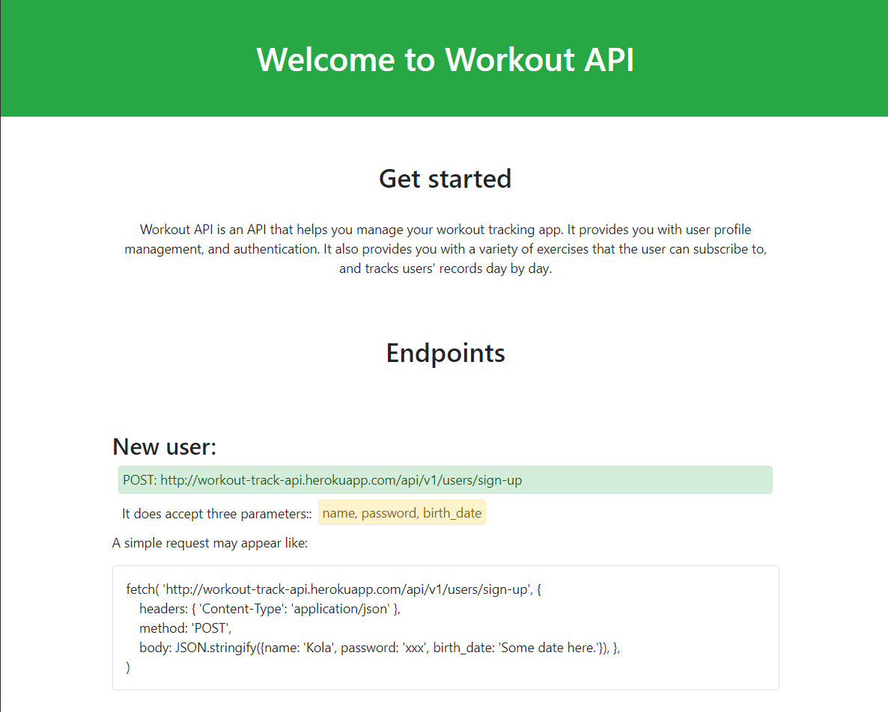

# Workout Track Api - Microverse Final Assessment Project

> This project is a workout API made with Ruby on Rails. It is an API that hold information that helps you to track the workout and body status statistics of your application users.

[See this example built with React for the front-end](http://workout-track-mob.herokuapp.com/)

<div align="center">



</div>

## Technologies

- Ruby
- Ruby on Rails
- Rspec
- PostgreSQL
- Bootstrap

## Live

[The API documentation](http://workout-track-api.herokuapp.com//)

## Usage

```
- git clone "https://github.com/Mohamed-js/workout_tracker_api.git"
- cd workout_tracker_api
- bundle install
- rails db:migrate
- rails db:seed
- rails s
```

## Testing

```
- git clone "https://github.com/Mohamed-js/workout_tracker_api.git"
- cd workout_tracker_api
- bundle install
- rails db:migrate RAILS_ENV=test
- rspec

```

## Authors

👤 **Mohammed Atef**

- GitHub: [Mohamed Atef](https://github.com/Mohamed-js)
- Twitter: [@Mohamed Atef](https://twitter.com/Demovejetta)
- LinkedIn: [LinkedIn](https://www.linkedin.com/in/mohamed-js/)

## 🤝 Contributing

Contributions, issues, and feature requests are welcome!

## Show your support

Give a ⭐️ if you like this project!

## Acknowledgments

- Microverse
- Notion

## 📝 License

This project is [MIT](https://github.com/Mohamed-js/Capstone-Project-1/blob/dev-area/LICENSE.md) licensed.
